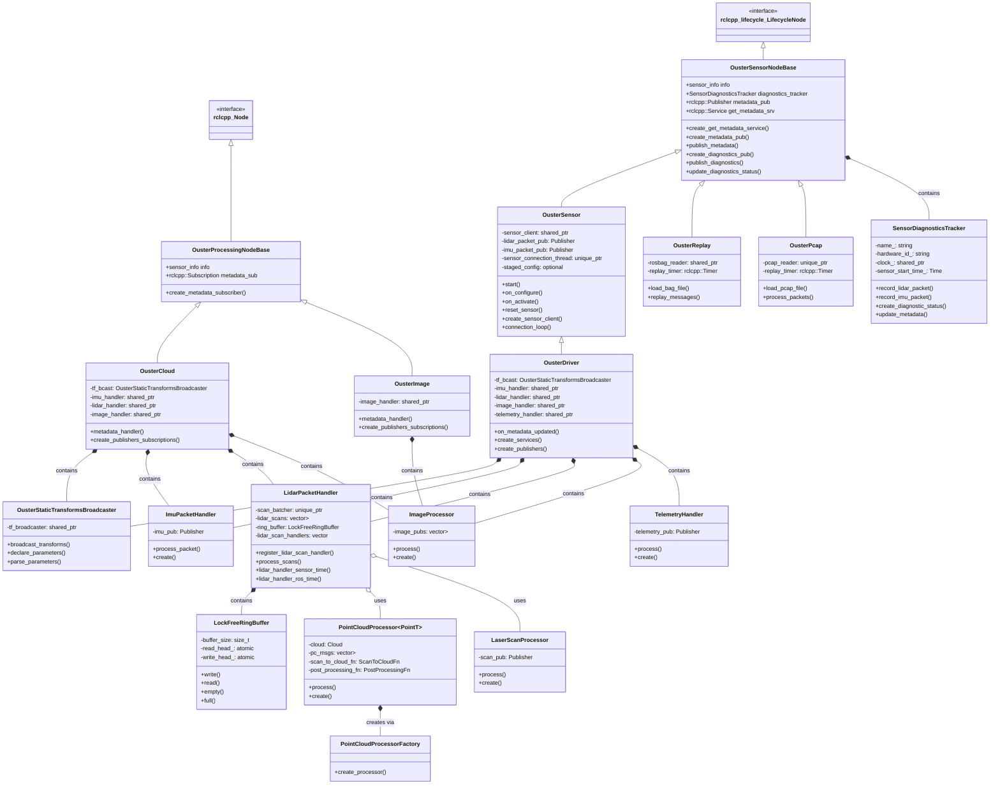

# Ouster ROS - Inheritance and Aggregation Chart

## Class Hierarchy Overview

## Key Architectural Patterns

### 1. **Inheritance Hierarchy**

#### Base Classes:
- **OusterSensorNodeBase**: Lifecycle-managed sensor nodes with diagnostics
- **OusterProcessingNodeBase**: Simple processing nodes that subscribe to metadata

#### Concrete Node Classes:
- **OusterSensor**: Basic sensor interface (publishes raw packets)
- **OusterDriver**: Full-featured sensor node (inherits from OusterSensor)
- **OusterCloud**: Point cloud processing node
- **OusterImage**: Image processing node
- **OusterReplay**: Bag file replay node
- **OusterPcap**: PCAP file replay node

### 2. **Composition and Aggregation**

#### Core Processing Components:
- **LidarPacketHandler**: Handles packet batching and threading
- **ImuPacketHandler**: Processes IMU data
- **ImageProcessor**: Converts lidar data to images
- **PointCloudProcessor<T>**: Template-based point cloud generation
- **LaserScanProcessor**: Generates 2D laser scans
- **TelemetryHandler**: Manages sensor telemetry

#### Utility Components:
- **SensorDiagnosticsTracker**: Monitors sensor health
- **OusterStaticTransformsBroadcaster**: Publishes TF transforms
- **LockFreeRingBuffer**: Thread-safe circular buffer
- **PointCloudProcessorFactory**: Factory pattern for processors

### 3. **Design Patterns Used**

1. **Template Pattern**: `PointCloudProcessor<PointT>` for different point types
2. **Factory Pattern**: `PointCloudProcessorFactory` for processor creation
3. **Handler/Strategy Pattern**: Different packet processors
4. **Observer Pattern**: Multiple handlers for lidar scan processing
5. **RAII Pattern**: Automatic resource management in handlers
6. **Producer-Consumer Pattern**: `LockFreeRingBuffer` for threading

### 4. **Threading Architecture**

- **OusterSensor**: Dedicated connection thread for sensor communication
- **LidarPacketHandler**: Processing thread with lock-free ring buffer
- **Lock-free design**: Minimizes blocking between producer and consumer threads

### 5. **Key Relationships**

#### Strong Composition (ownership):
- Nodes own their processors and handlers
- Processors own their internal data structures

#### Weak Aggregation (usage):
- Handlers use multiple processors via callbacks
- Factory creates processors but doesn't own them
- Processors can be shared among handlers

This architecture provides a flexible, modular design that separates concerns while maintaining efficient data flow through the processing pipeline.
